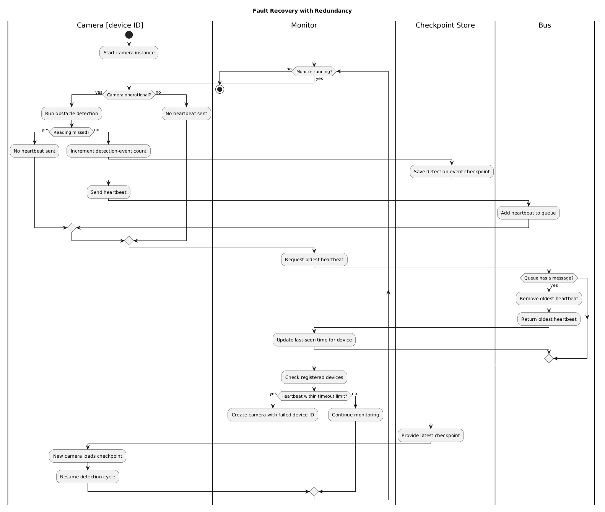
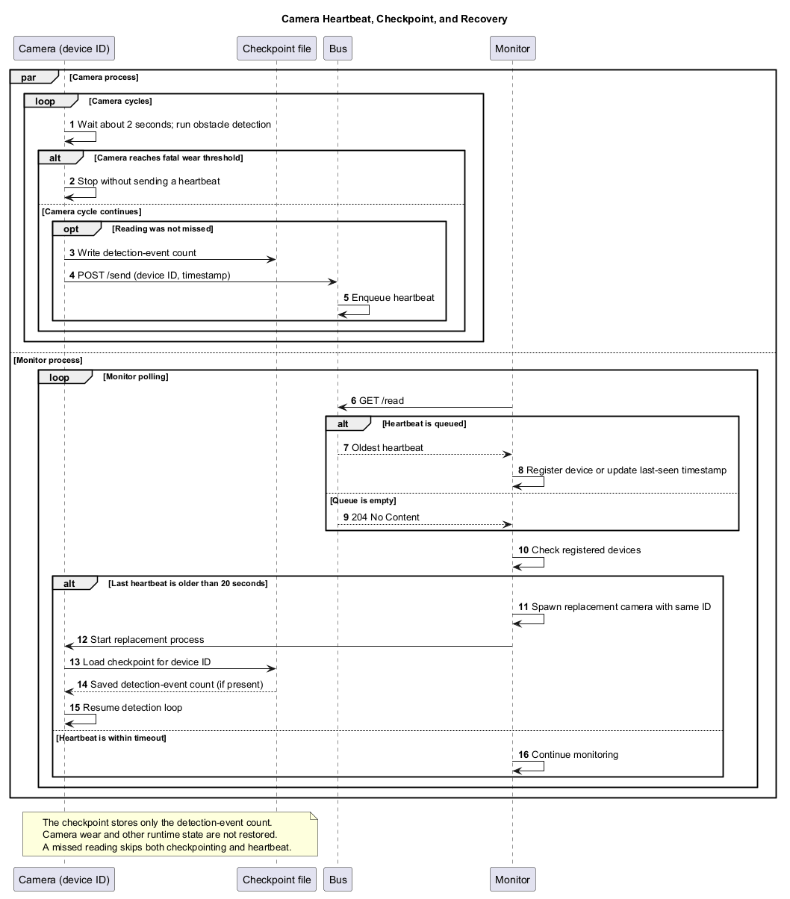

# Heartbeat Tactic Implementation
This project represents a mock implementation of a use-case of the "Heartbeat" availability tactic in the context of an
autonomous vehicle. Three separate types of processes are created, each described below and each mimicking one component within
the object detection subsystem in an autonomous vehicle. First, a "camera" process mimics the actual object detection,
with random chance failures to demonstrate the use of the heartbeat tactic. Each camera publishes its heartbeat pings to
the second process, an HTTP server serving as a mock CAN bus, which stores those pings and their timestamps in a
message queue mimicking the queue-like properties of the real CAN bus. Finally, a Monitor process repeatedly checks the 
bus for pings regularly, tracking active heartbeat devices and the timestamps of their most recent pings.

# Fault Recovery with Redundancy Implementation
The Fault Recovery with Redundancy implementation builds on the heartbeat system with monitor-driven camera restarts and per-camera checkpoints. Cameras write a checkpoint after a detection cycle that was not missed. If a camera stops sending heartbeats, the monitor starts a replacement with the same device ID; that process loads the saved detection-event count before resuming its detection loop. The checkpoint is deliberately limited: it does not restore camera wear, failure state, or obstacle-detection state.

The monitor currently declares a camera unresponsive when its last heartbeat is more than 20 seconds old. Cameras normally attempt a cycle every two seconds, and a missed reading sends neither a checkpoint nor a heartbeat. The replacement therefore resumes from the last saved event count, not necessarily the exact instant or complete runtime state of the failed process.

## Design Rationale and Trade-offs

### Heartbeat timeout detects loss without sharing camera internals
The monitor maintains a loose connection between detection and camera implementation, requiring simply device IDs and timestamps. Shorter timeouts speed up recovery but increase false restarts during scheduling or communication delays; a 20-second timeout can withstand sporadic delays but may leave a failed camera unreplaced for up to that amount of time. A timeout is unable to differentiate between a slow or disconnected camera and one that has crashed.

### Restarting with the same ID preserves device identity
The bus and monitor interfaces stay the same, but the replacement is controlled by the current monitor. During detection and restart, this straightforward passive-redundancy approach does not offer a hot standby or continuous sensing.

### A small per-camera checkpoint keeps recovery inexpensive
Limiting wasted progress and preventing checkpointing on each loop iteration are achieved by maintaining the detection-event count following each non-missed cycle. The camera is a full transaction, and this is not on the runtime runtime runtime. A crash during a write might result in stale or illegible data, and host loss eliminates the only copy because local file writes add I/O and are neither atomic nor duplicated. SIGINT/SIGTERM cleanup deletes the checkpoint, so automatic recovery retains state only when the camera exits abnormally rather than through that graceful shutdown path.

### Automatic restart favors availability over diagnosis
After a timeout, the monitor respawns without imposing a retry limit or backoff or classifying the problem. As a result, recurrent restarts may result from persistent issues, and heartbeat loss brought on by the bus or network may be confused with a camera malfunction.

These trade-offs are appropriate for a checkpoint-based recovery and heartbeat-based detection demonstration. Validated sensor data, constrained restart policies, checkpoint integrity and atomicity, explicit fault categorization, and safe behavior in the event of unavailability camera coverage are all necessary for a production vehicle system.

# Libraries Used
- httplib: This C++ library is used in our project to create the HTTP server used to imitate the Bus component. This HTTP server is used to facilitate the simulated communication channels of our system. All communication between the Cameras and the Monitor component passes through the centralized HTTP server of the Bus component. 
- json: This library C++ library was used to send data between the components of our system with json formatting. These json messages are the payloads sent by the Cameras, and respectively read by the Monitor. 

# Build Instructions

## Operating System Requirements
This project comes shipped with an automated build script to automate the build and startup of all processes needed for
the demo. This script is written assuming a Unix-based operating system, meaning that Windows is not natively supported
by our build script. On Windows, consider running this project from within the [Windows Subsystem for Linux
(WSL)](https://learn.microsoft.com/en-us/windows/wsl/install). 

## Running The Build Script 
Before running the build script, make sure CMake is installed and at a version >=4.3. Then, simply run `./build.sh` to
automatically compile the targets for the demo and start, in separate processes, the Bus, the Monitor, and three
Cameras. The Cameras will then publish heartbeat pings to the Bus, which will be viewed by the Monitor. Camera processes
will also show some mock output imitating real object detection behavior. 

## Building Without the Script
To build the app without the script, use the following CMake commands:
```
cmake -B build
cmake --build build
```

This will compile the CPP files for the project. Output directories for each targtet will be present in the `build/targets` 
directory, with each including executable object modules for its respective target. Each process
can be started directly from the command-line within the corresponding directory. The Bus process should be started 
first, then the Monitor and any Cameras can be started in separate terminal windows. When running the Camera processes, 
note that a device ID must be provided as a command line argument. 

# Implementation Diagram Narrative


This project is a mock implementation of a use-case of the "Heartbeat" availability tactic in the context of an
autonomous vehicle. The Implementation Diagram shows the separate modules we created and how they interact. As a summary, 
three separate types of processes are created, each mimicking one component within the object detection subsystem in an
autonomous vehicle. First, a "camera" process mimics the actual object detection, with random chance failures to 
demonstrate the utility of the heartbeat tactic. Each camera publishes its heartbeat pings to the second process, an HTTP 
server serving as a mock CAN bus, which stores those pings and their timestamps in a message queue to mimic the queue-like
properties of the real CAN bus. Finally, a Monitor process repeatedly checks the bus for pings, tracking active heartbeat
devices and the timestamps of their most recent pings. 

## Camera Processes
The Camera processes are relatively simple. Each Camera process enters a loop on startup, first waiting for a delay
period then performing mock object detection with randomly generated object distances. Detection results stay local in
this demo. After a cycle that was not missed, the camera checkpoints its detection-event count and sends a heartbeat
containing its device ID and timestamp to the Bus using HTTP POST. Camera wear can eventually cause a fatal failure, and
wear also increases the chance of missed readings, allowing the Monitor's detection and recovery behavior to be
demonstrated.

## Bus Process 
The Bus process is a mock version of the CAN bus in an autonomous vehicle, the bus on which a real heartbeat might be
sent. In our case, the Bus is imitated using an HTTP server with an internal message queue. This server serves two
endpoints, a POST endpoint for Camera processes to send their heartbeat pings and a GET endpoint for the Monitor to use
to receive heartbeat pings. When a Camera sends a ping via the POST endpoint, the Bus places it on an internal message
queue, from which messages are taken and sent to the Monitor with each GET request. This mimics the queueing behavior of
a real CAN bus, and allows for multiple clients on different processes or even different machines to be handled
concurrently for the demo. 

## Monitor Process
The Monitor represents the central monitor of a real heartbeat system, constantly checking and tracking the status of
the "beating hearts" within the system. Our Monitor accomplishes this by repeatedly sending GET requests to the Bus to
pull heartbeats off of the message queue. With each message received, the Monitor first checks if the pinging device has
been seen before, saving the deviceID and initial ping time if not. If the device has been seen before, the Monitor
updates the most recently received heartbeat timestamp for that device, and moves on. If any devices have not sent a
heartbeat for more than 20 seconds, the Monitor starts a replacement camera with the same device ID.

# Fault Recovery Activity Diagram Narrative


## Summary

This activity diagram shows which actions are performed by the cameras, bus, monitor, and checkpoint throughout the process of fault detection (using the heartbeat pattern) and recovery (using passive redundancy and checkpoints). 

## Walkthrough

The process starts with a camera instance. While operational, it simulates obstacle detection locally; the Bus carries heartbeat metadata, not detection results.

After a detection cycle that was not missed, the camera saves its detection-event count to a per-device checkpoint, then sends its heartbeat to the Bus. A missed reading skips both operations. The checkpoint does not include camera wear or other runtime state.

The monitor repeatedly reads the oldest heartbeat from the Bus and tracks each registered camera's last-seen timestamp. When a camera has not sent a heartbeat for more than 20 seconds, the monitor treats it as unresponsive and starts a replacement with the same device ID.

On startup, the replacement loads the latest checkpoint for its device ID, if one exists. It resumes with the saved detection-event count; camera wear starts over, so this is partial state recovery rather than a complete continuation of the failed process.

## Importance

The activity diagram primarily emphasizes the responsibilities of each subcomponent in the camera system, particularly as they relate to the Fault Detection and Recovery process. 

This activity diagram focuses on the Fault Recovery with Redundancy tactic:
- After non-missed detection cycles, cameras store their detection-event count
- Missing heartbeats are treated as evidence of failure or disconnection
- After missing heartbeats exceed the timeout threshold, a camera is flagged as failed
- Once a camera fails, the monitor starts up a replacement camera
- The replacement camera uses the ID of the failed camera to access its most recent checkpoint
- The replacement restores that count, but not wear or other runtime state
- The replacement resumes with partial, not complete, state continuity

# Heartbeat Sequence Diagram Narrative


## Summary

This sequence diagram shows camera checkpointing, heartbeat transport through the bus, monitor-based failure detection, and replacement startup with the same device ID.

Each camera normally waits about two seconds between detection cycles. The monitor polls the bus and checks each registered camera against a 20-second heartbeat timeout.

## Walkthrough

### 1. Camera sends a heartbeat

The first message in the flow is:

`Camera -> Bus: Send heartbeat message`

Before posting its heartbeat, a camera that was not failed and did not miss its reading writes its detection-event count to `checkpoints/camera_checkpoint_<deviceID>`. A missed reading skips both the checkpoint and heartbeat. The heartbeat is an HTTP message containing the device ID and timestamp; obstacle readings are simulated locally and are not sent over the bus in this implementation.

### 2. Bus stores the heartbeat

The next step is:

`Bus -> Bus: Store heartbeat message`

The bus is modeled as a queue-like data structure for storing heartbeats. The monitor's GET request removes the oldest queued heartbeat and uses its timestamp to register the device or update its last-seen time.

## Monitor loop

The central loop is labeled:

`loop Monitor Bus for Camera Heartbeats`

This illustrates that the monitor process runs a repeated check over time. Within this loop, the monitor:

1. Reads the next heartbeat from the bus
2. Receives the oldest stored heartbeat message
3. Updates the last timestamp for the sending device

This is represented as:

- `Monitor -> Bus: Read next heartbeat`
- `Bus --> Monitor: Oldest heartbeat`
- `Monitor -> Monitor: Set received device's last timestamp`

The monitor keeps track of the latest timestamp for each camera registered with itself. That timestamp becomes the basis for deciding whether the device is still alive or has faulted in some way and became seemingly unresponsive.

## Device health check

The next nested loop is:

`loop All registered devices`

The system is checking every known camera in its device list, not just the one that most recently sent a message.

Inside that loop is an optional branch:

`opt Camera has not sent a heartbeat for more than 20 seconds`

This condition means:

- A device has not sent a heartbeat within the configured timeout
- The monitor interprets this as a failure
- The camera is considered no longer alive

The monitor treats this timeout as evidence of unavailability and forks a replacement camera using the failed device's ID. On startup, the replacement loads that camera's checkpoint when one is present, then resumes detection. The checkpoint restores only the detection-event count, not camera wear or other runtime state. Recovery is not instantaneous, and a timeout cannot distinguish a crashed camera from delays or communication failure.

## Importance

This sequence captures the complete heartbeat tactic:

- Device activity is announced through periodic heartbeat messages
- The shared bus acts as a temporary buffer on a separate process
- The monitor maintains camera health state for each device also on a separate process
- Missing heartbeats beyond the timeout trigger replacement, not merely a log message
- The replacement loads a per-camera detection-event checkpoint before resuming

This demo illustrates recovery after heartbeat loss but does not guarantee uninterrupted sensing or prove that a timed-out camera has physically failed. A production vehicle system would need explicit fault classification, bounded restart policies, durable checkpoints, and safe behavior whenever camera coverage is unavailable.
