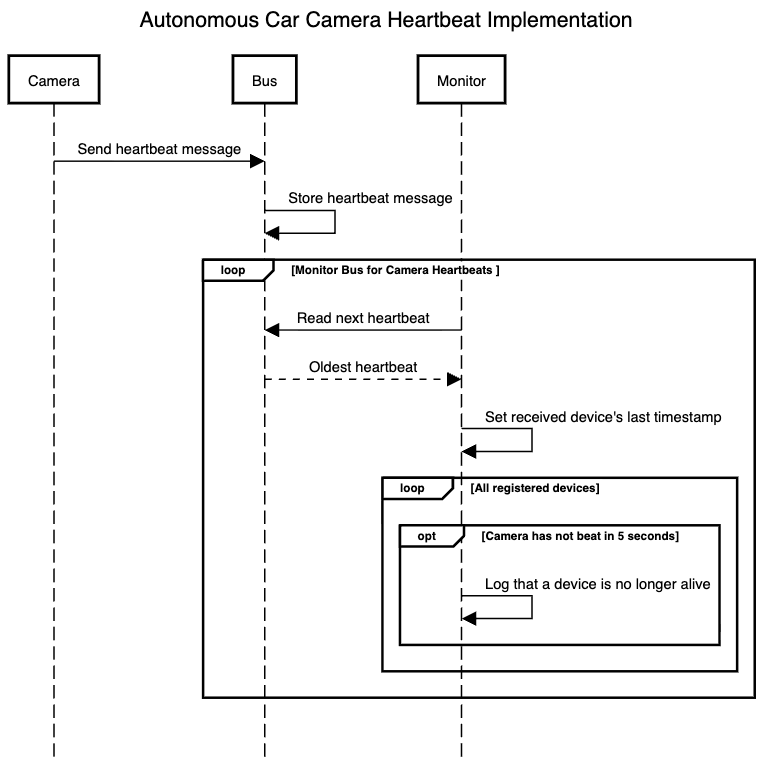

# Heartbeat Sequence Diagram

## Summary

This sequence diagram shows the interactions between the various number of cameras, the bus that receives heartbeats, and the monitor that tracks cameras and aliveness of the system.

Here, the crucial piece relies on a periodic monitoring loop. Cameras send heartbeat messages to the bus, and the monitor inspects the bus to determine whether any camera has stopped sending heartbeats within the allotted amount of time.

## Walkthrough

### 1. Camera sends a heartbeat

The first message in the flow is:

`Camera -> Bus: Send heartbeat message`

This represents a camera publishing a lightweight message to the bus process. The message acts as a "still alive" notification, confirming that the device is operating normally. This occurs over HTTP.

### 2. Bus stores the heartbeat

The next step is:

`Bus -> Bus: Store heartbeat message`

The bus is modeled as a queue-like data structure for storing heartbeats. Each heartbeat is stored with its timestamp, so the system can later determine when the most recent message from a device was received. This occurs all within the bus's HTTP request handler.

## Monitor loop

The central loop is labeled:

`loop Monitor Bus for Camera Heartbeats`

This illustrates that the monitor process runs a repeated check over time. Within this loop, the monitor:

1. Reads the next heartbeat from the bus
2. Receives the oldest stored heartbeat message
3. Updates the last timestamp for the sending device

This is represented as:

- `Monitor -> Bus: Read next heartbeat`
- `Bus --> Monitor: Oldest heartbeat`
- `Monitor -> Monitor: Set received device's last timestamp`

The monitor keeps track of the latest timestamp for each camera registered with itself. That timestamp becomes the basis for deciding whether the device is still alive or has faulted in some way and became seemingly unresponsive.

## Device health check

The next nested loop is:

`loop All registered devices`

The system is checking every known camera in its device list, not just the one that most recently sent a message.

Inside that loop is an optional branch:

`opt Camera has not beat in 5 seconds`

This condition means:

- A device has not sent a heartbeat within the configured timeout
- The monitor interprets this as a failure
- The camera is considered no longer alive

The corresponding action is:

`Monitor -> Monitor: Log that a device is no longer alive`

Crucially, instead of waiting for a device to fail dramatically or unknowingly, the system notices when a device stops sending expected periodic heartbeats and notifies.

## Importance

This sequence captures the complete heartbeat tactic:

- Device activity is announced through periodic heartbeat messages
- The shared bus acts as a temporary buffer on a separate process
- The monitor maintains camera health state for each device also on a separate process
- Missing heartbeats are treated as evidence of failure or disconnection

In a real autonomous vehicle subsystem, this tactic helps ensure that camera sensors continue to report health. If a camera stops responding, the system can log the issue and/or take corrective actions before the monitored system fails catastrophically or without knowing.
